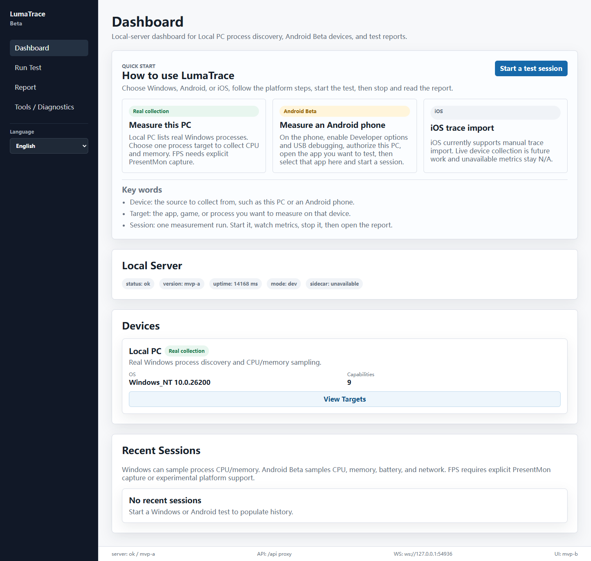
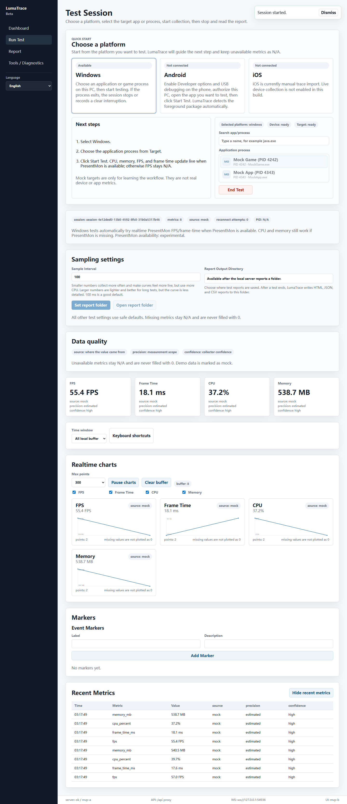
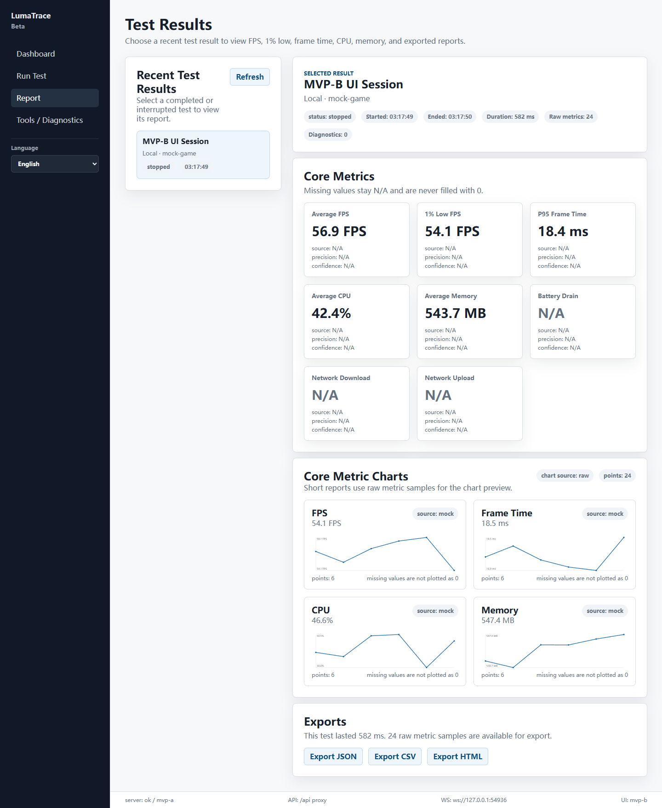

# LumaTrace 中文说明

> English is the primary documentation language. This page is a Chinese companion overview for Chinese readers.

LumaTrace 是一个开源、本地优先、clean-room 的跨平台性能测试工具。它面向 Windows、Android 和 iOS 的应用或游戏测试流程，重点是让用户能够开始测试、查看实时指标、结束测试并生成报告。所有指标都会保留 `source`、`precision`、`confidence` 和 availability 信息；无法采集的指标显示 `N/A`，不会填 0 或伪造。

## 下载

当前 Windows 预览版安装包在 GitHub Releases：

[下载最新 Windows 预览版](https://github.com/a16036868481/LumaTrace/releases/latest)

注意：当前安装包仍是未签名预览版，`productionReady=false`，Windows 可能会显示 SmartScreen 提示。它不是正式生产发布。

## 界面截图

| 仪表盘 | 进行测试 | 测试报告 |
| --- | --- | --- |
|  |  |  |

## 当前能力

- Windows：发现本机进程，选择应用或游戏进程后采集 CPU、内存；PresentMon 可用且用户显式启用时，尝试采集 FPS 和帧时间。
- Android：通过 adb 发现设备和应用，采集 CPU、内存、电池、网络；支持 App lifecycle、PID rebind 和诊断时间线；FPS/帧时间仍是实验能力。
- iOS：提供 Xcode/xcrun/xctrace 检测、模拟器目标解析、手动 xctrace CSV 导入和显式 xctrace capture 基础能力；稳定实时 iOS 采集仍未完成。
- 报告：测试结束后可导出 HTML、JSON、CSV；报告保留指标来源、精度和置信度，并对敏感信息做脱敏。
- 打包：Tauri 桌面宿主、local-server sidecar、本地 token 鉴权、日志/诊断脱敏和 Windows 预览安装包流程已经建立。

## 暂未实现

- 正式生产安装包签名、自动更新和商店发布。
- production-ready 的完全自包含 sidecar。
- 稳定 Android FPS/帧时间。
- 稳定 iOS 实时采集。
- GPU telemetry、ETW SDK consumer、overlay、云端同步。
- 默认采集 logcat、bugreport、syslog 或其他隐私日志。

## 快速开始

开发模式需要分别启动后端和前端：

```bash
pnpm install
pnpm dev:server
pnpm dev:desktop
```

常用验证：

```bash
pnpm test
pnpm typecheck
pnpm lint
pnpm build:desktop
pnpm verify:android-beta
pnpm verify:pc-beta
pnpm verify:ios-beta
pnpm verify:packaging-hardening
```

Windows 预览版安装包会发布在 GitHub Releases。当前预览包仍是未签名构建，`productionReady=false`，不是正式生产发布。

## 怎么提交 Bug 或建议

请在 GitHub Issues 提交：

[https://github.com/a16036868481/LumaTrace/issues](https://github.com/a16036868481/LumaTrace/issues)

建议附上：

- LumaTrace 版本；
- Windows、Android 或 iOS 版本；
- 设备型号或模拟器名称；
- 你点击了什么、期望发生什么、实际发生什么；
- 截图；
- 软件导出的脱敏 diagnostics。

请不要上传：

- token、cookie、账号信息；
- 完整本地路径；
- 原始日志、raw CSV、logcat、bugreport；
- 含隐私内容的截图；
- 设备完整序列号或其他敏感标识。

## 数据真实性和隐私原则

- 不使用 ROOT、越狱或私有 API 作为默认方案。
- 不绕过系统权限。
- 不默认采集隐私日志。
- 不上传云端。
- 不把设备级指标伪装成 App 或进程级指标。
- 不把缺失指标填成 0。
- Mock 数据必须明确标记为 mock。

## 相关文档

- [Main README](README.md)
- [Architecture](docs/architecture.md)
- [Metric Definitions](docs/metric-definitions.md)
- [Platform Limitations](docs/platform-limitations.md)
- [Privacy and Security](docs/privacy-security.md)
- [Android Beta](docs/android-beta.md)
- [PC Beta](docs/pc-beta.md)
- [iOS Beta](docs/ios-beta.md)
- [Tauri Packaging](docs/tauri-packaging.md)
- [Windows Preview Release](docs/windows-preview-release.md)
